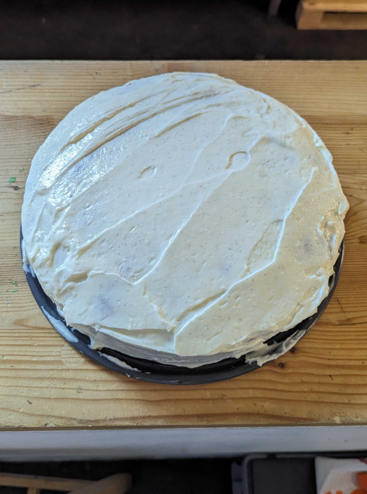

+++
title = "Carrot Cake"
+++

# Ingredients

## Cake Batter

| Flour | Sugar | Eggs | Sunflower Oil | Baking Powder | Baking Soda | Salt | Cinnamon | Nutmeg | Ginger |
|:-----:|:-----:|:----:|:-------------:|:-------------:|:-----------:|:----:|:--------:|:------:|:------:|
| 240g  | 400g  |  3   |     230ml     |      4g       |     3g      |  5g  |    5g    |   2g   |   2g   |

## Carrot mixture for the batter

| Carrots   | Walnuts or Pecans   | Honey   | Butter  |
| :-------: | :-----------------: | :-----: | :-----: |
| 180g      | 120g                | 50 g    | 20g     |

## Icing

| Cream Cheese | Butter | Powdered Sugar | Vanilla Bean |
|:------------:|:------:|:--------------:|:------------:|
|     400g     |  150g  |      150g      |    1 bean    |

---

# Instructions

## Carrot mixture

* Melt butter in a hot pan
* Combine nuts and honey in the pan
    * Cook until nuts begin to brown
* Stir in carrots until fully mixed with honey and nuts
    * Cook until carrots begin to brown

## Cake
* Preheat oven to 200&deg;C
* Mix dry ingredients, except for sugar, together
* Mix eggs, oil, and sugar
    * Mix until sugar is dissolved
* Stir in dry ingredients gradually
* Stir in carrot mixture
* Bake for 30 or so minutes, until the cake's center is no longer liquid
    * This has taken up to 45-50 minutes depending on the batter's viscosity.

## Icing
* Soften butter to "room temperature"
* Mix butter and cream cheese until smooth and homogeneous
* Mix in powdered sugar gradually to avoid a mess
* Add in vanilla and mix thoroughly

---

# Notes
Reference for instructions: https://www.epicurious.com/recipes/food/views/carrot-cake-with-cream-cheese-frosting-51191810

